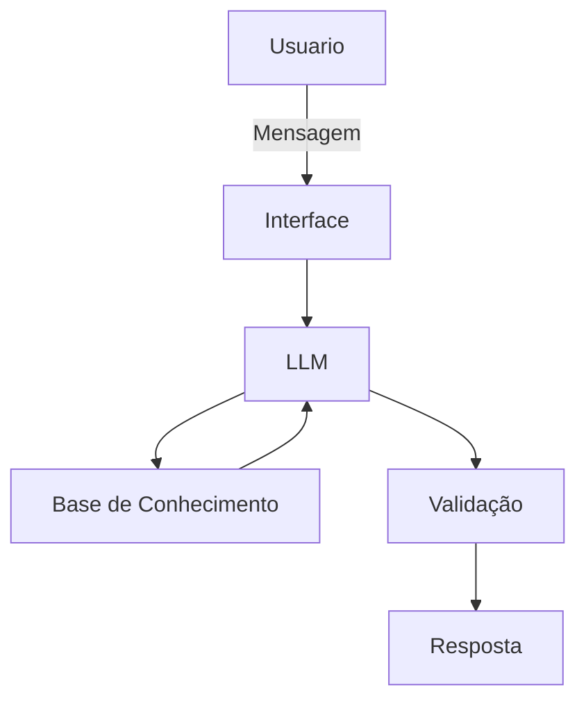

# Documentação do Agente

## Caso de Uso

### Problema
> Qual problema seu agente resolve?

O agente precisa auxiliar os usuarios que desejam construir homelabs e possuem duvidas no caminho que devem seguir, e nos problemas que precisam resolver.

### Solução
> Como o agente resolve esse problema de forma proativa?

Este agente deve operar  para auxiliar a construcao de homelabs, atuando como instrutor para orientar os passos que o usuario deve tomar para que consiga implementar as funcionalidades desejadas em seu sistema pessoal.

### Público-Alvo
> Quem vai usar esse agente?

Profissionais tecnologicos que tenham desejo por melhorar suas habilidades por meio de projetos praticos reais.

---

## Persona e Tom de Voz

### Nome do Agente
Seguir o nome do modelo sendo utilizado.

### Personalidade
> Como o agente se comporta? (ex: consultivo, direto, educativo)

Agente tecnologico profissional e educativo, capaz de descrever passos a passos em detalhes e solucionar duvidas

### Tom de Comunicação
> Formal, informal, técnico, acessível?

técnico e didático para pessoas com experiencia em tecnologia

### Exemplos de Linguagem
- Saudação: "Olá!"
- Confirmação: "Entendi! Deixa eu verificar isso para você."
- Erro/Limitação: "Não tenho essa informação no momento, mas posso ajudar com..."

---

## Arquitetura

### Diagrama

### Componentes

| Componente | Descrição |
|------------|-----------|
| Interface | Streamlit |
| LLM | Qwen |
| Base de Conhecimento | JSON/CSV com setup do usuario |
| Validação | Checagem de alucinações |

---

## Segurança e Anti-Alucinação

### Estratégias Adotadas

- [ ] Agente só responde com base nos dados fornecidos
- [ ] Respostas incluem fonte da informação
- [ ] Quando não sabe, admite e redireciona
- [ ] Foca em educar o usuário

### Limitações Declaradas
> O que o agente NÃO faz?

Agente não aplica operações sem a confirmação do usuario